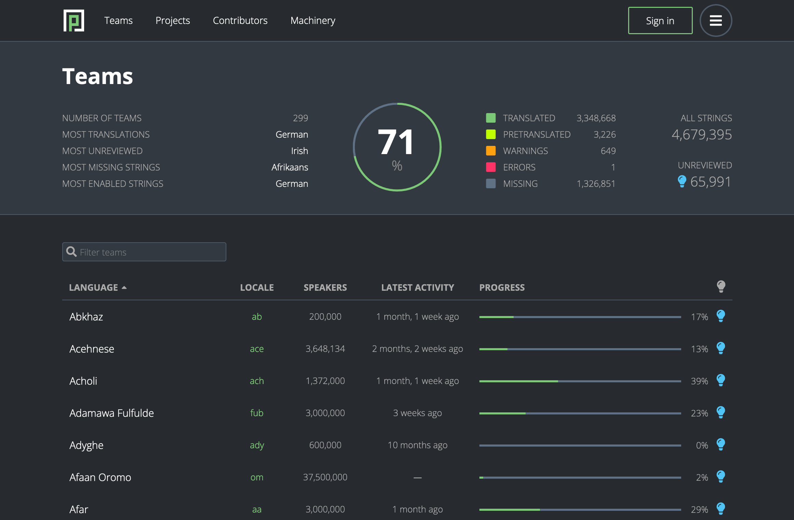
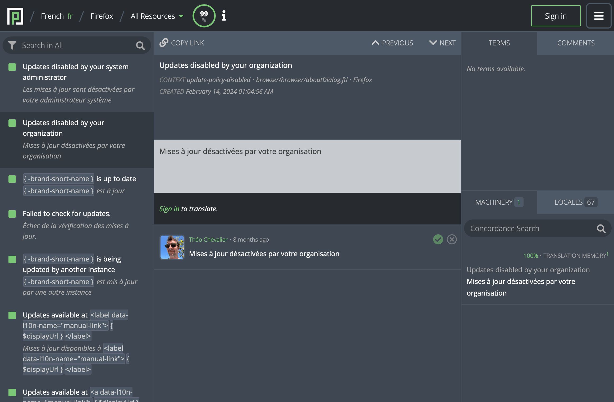

# Pontoon &mdash; Mozilla's Localization Platform

Pontoon is a translation management system used and developed by the
[Mozilla localization community](https://pontoon.mozilla.org/). It
specializes in open source localization that is driven by the community and
uses version control systems for storing translations.

[📚 **Documentation**](https://pontoon.mozilla.org/docs/dev/)

## Installing Pontoon

If you are looking to host your own instance of Pontoon, follow our
[Deployment Documentation](https://pontoon.mozilla.org/docs/dev/deployment/). It
describes how Mozilla deploys Pontoon — as a Docker image running on Google
Cloud Platform — so you may need to adapt it for your own platform.

If you only want to deploy a **local instance of Pontoon**, for development or
testing for example, see our
[Developer Setup](https://pontoon.mozilla.org/docs/dev/developer-setup/). Please
note that the development setup is **not** suitable for production use.

## Contributing to Pontoon

Do you want to help us make Pontoon better? We are very glad!

To help you get started with contributing, we wrote
[**The Guide to your First Contribution to Pontoon**](https://pontoon.mozilla.org/docs/dev/first-contribution/).
It contains all the information you need to know to install Pontoon, populate its
database, run tests, and send your contribution.

If you want to go further, you can:

- Check out [development roadmap](https://github.com/orgs/mozilla/projects/220)
- Report an [issue](https://github.com/mozilla/pontoon/issues/new)
- Check [existing issues](https://github.com/mozilla/pontoon/issues), including [good first issues](https://github.com/mozilla/pontoon/issues?q=is%3Aopen+is%3Aissue+label%3A%22good+first+issue%22)
- See Mozilla's Pontoon servers:
  - [Staging](https://pontoon.allizom.org/)
  - [Production](https://pontoon.mozilla.org/)
- For discussing Pontoon's development, get in touch with us on [chat.mozilla.org](https://chat.mozilla.org/#/room/#pontoon:mozilla.org)
- For feedback, support, and 3rd party deployments, check out [GitHub Discussions](https://github.com/mozilla/pontoon/discussions)

## License

This software is licensed under the
[New BSD License](https://creativecommons.org/licenses/BSD/). For more
information, read the [LICENSE](https://github.com/mozilla/pontoon/blob/HEAD/LICENSE).

## Screenshots

_Teams dashboard_

_Translation app_
