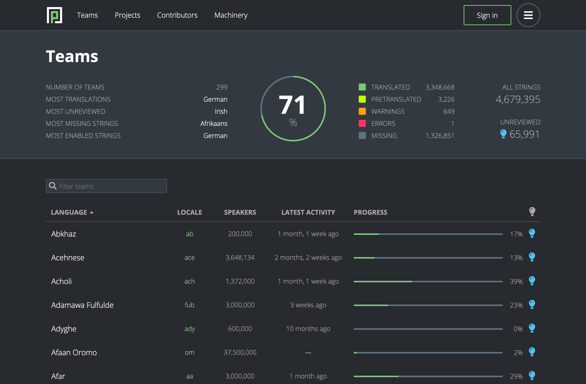
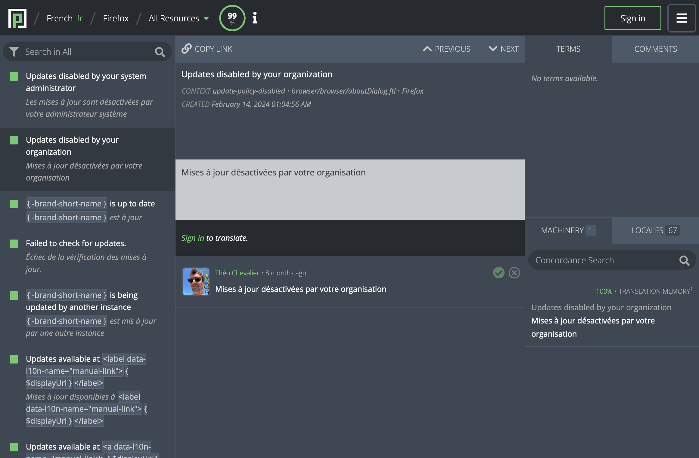

# Pontoon &mdash; Mozilla's Localization Platform

Pontoon is a translation management system used and developed by the
[Mozilla localization community](https://pontoon.mozilla.org/). It
specializes in open source localization that is driven by the community and
uses version-control systems for storing translations.

[📚 **Documentation**](https://mozilla-pontoon.readthedocs.io/)

## Installing Pontoon

If you are looking to host your own instance of Pontoon, there are several ways to do so.
To deploy Pontoon to Heroku without leaving your web browser, click the **Deploy to
Heroku** button below.

Alternatively, you can deploy to Heroku manually by following our
[Deployment Documentation](https://mozilla-pontoon.readthedocs.io/en/latest/admin/deployment.html).

We don't have documentation for deploying to other platforms yet, so we recommend that
you read the previously linked documentation and adapt it for your needs.

If you only want to deploy a **local instance of Pontoon**, for development or
testing for example, see our
[Developer Setup using Docker](https://mozilla-pontoon.readthedocs.io/en/latest/dev/setup.html).
Please note that you should **not** deploy a production instance with Docker.

## Contributing to Pontoon

Do you want to help us make Pontoon better? We are very glad!

To help you get started with contributing, we wrote
[**The Guide to your First Contribution to Pontoon**](https://mozilla-pontoon.readthedocs.io/en/latest/dev/first-contribution.html).
It contains all the information you need to know to install Pontoon, populate its
database, run tests, and send your contribution.

If you want to go further, you can:

* Check out development roadmap on the [wiki](https://wiki.mozilla.org/Pontoon)
* Report an [issue](https://github.com/mozilla/pontoon/issues/new)
* Check [existing issues](https://github.com/mozilla/pontoon/issues)
* See Mozilla's Pontoon servers:
    * [Staging](https://mozilla-pontoon-staging.herokuapp.com/)
    * [Production](https://pontoon.mozilla.org/)
* For discussing Pontoon's development, get in touch with us on [chat.mozilla.org](https://chat.mozilla.org/#/room/#pontoon:mozilla.org)
* For feedback, support, and 3rd party deployments, check out [Discourse](https://discourse.mozilla.org/c/pontoon/)

## License

This software is licensed under the
[New BSD License](https://creativecommons.org/licenses/BSD/). For more
information, read [LICENSE](https://github.com/mozilla/pontoon/blob/master/LICENSE).

## Screenshots

*Teams dashboard*

*Translation app*
