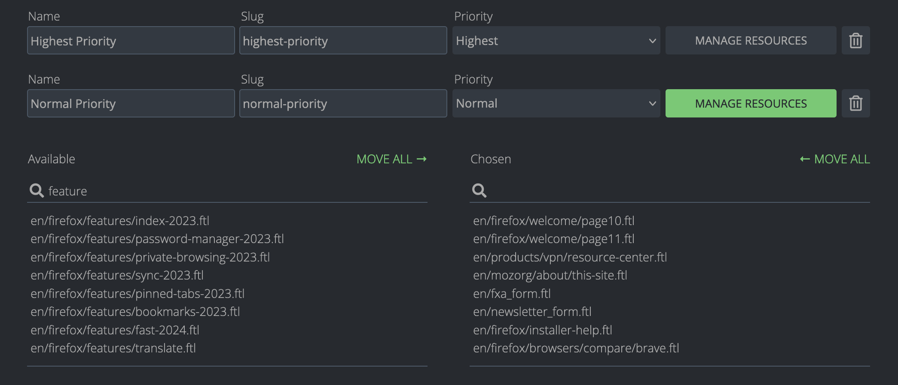

# Adding a New Project

The following page describes how to make your projects localizable with your Pontoon instance.

Pontoon specializes in using version control systems as the source and store of localizable strings. While [internal Pontoon DB](adding-new-db-project.md) can be used for that purpose as well, steps below assume you store strings in a [GitHub repository](https://help.github.com/en/articles/create-a-repo).

## Verify that the project is properly localizable

Before you can set up a new project in Pontoon:

1.  Ensure your project works with one of the supported l10n frameworks:
    * `.dtd`
    * `.ftl` (Fluent)
    * `.ini`
    * `.json` (WebExtensions)
    * `.json` (key-value)
    * `.po` (Gettext)
    * `.properties`
    * `.xliff`
    * `.xml` (Android)

2.  Extract localizable strings into resource files.

3.  Push resource files to your GitHub repository.

4.  Make sure your Pontoon instance has write access to your repository ([see this document](https://mozilla-l10n.github.io/documentation/misc/creating_new_repository.html#add-collaborators)).

!!! tip "Tip"
    The recommended way for that is to create a dedicated GitHub account for your Pontoon instance, [add it as a collaborator](https://help.github.com/en/articles/inviting-collaborators-to-a-personal-repository) to your repository, and set `SSH_KEY` and `SSH_CONFIG`.

It’s important to also check the files for localization issues before exposing them to localizers: unclear strings, lack of localization comments, missing plural forms are some of the things to check.

## Folder structure

To let Pontoon discover your localizable files, you'll either need to specify paths in the [project configuration file](https://moz-l10n-config.readthedocs.io/en/latest/fileformat.html) or strictly follow the file and folder structure as expected by Pontoon:

1. Locale folders (including source locale) must be located at the same nesting level of the directory tree. You may want to put all locale folders under a `locales` folder.
1. Source locale needs to be called `templates`, `en-US`, `en-us` or `en`. If multiple folders with such name exist in the repository and contain files in a supported file format, the first one will be used.
1. Locale folder names must always match locale identifiers used by Pontoon. If your application requires different identifiers, you can try creating symbolic links to locale folders.
1. Locale code must not be part of the file name.

Correct pattern:

    locales/{locale_code}/path/to/file.extension

Incorrect pattern:

    locales/{locale_code}/path/to/file.{locale_code}.extension

!!! note "Gettext .po files"
    For Gettext files, you will need to ensure that `.po` files are included in the repository for each target locale for which they are to be translated (these files may be initially empty). For all other supported formats, Pontoon will automatically add files for each locale when it is translated.

## Create the project

Access Pontoon’s [admin console](https://pontoon.mozilla.org/admin/) and click **ADD NEW PROJECT**.

The new project will appear in the [public list of Projects](https://pontoon.mozilla.org/projects/) only after the next sync cycle.

* Name: name of the repository (it will be displayed in Pontoon’s project selector).
* Slug: used in URLs, will be generated automatically based on the repository’s name.
* Locales:

  * Select at least one locale. To make things faster it’s possible to copy supported locales from an existing project.
  * The *Read-only* column can be used to add languages in read-only mode. In this way, their translations will be available to other languages in the LOCALES tab when translating, but it won’t be possible to change or submit translations directly in Pontoon.
  * You can uncheck the `Locales can opt-in` checkbox to prevent localizers from requesting this specific project.

* Repositories: select the type of repository and URL. Make sure to use SSH to allow write access. For example, if the repository is `https://github.com/meandavejustice/min-vid`, the URL should be `git@github.com:meandavejustice/min-vid.git`. You can use the *Clone or download* button in the repository page on GitHub, making sure that *Clone with SSH* is selected.
* Leave the `Branch` field empty, unless developers asked to commit translations in a specific branch instead of the default one (usually `main` or `master`).
* Download prefix or path to TOML file: a URL prefix for downloading localized files. For GitHub repositories, select any localized file on GitHub, click `Raw` and replace locale code and the following bits in the URL with `{locale_code}`. For example, if the link is `https://raw.githubusercontent.com/bwinton/TabCenter-l10n/master/locales/en-US/addon.properties`, the field should be set to `https://raw.githubusercontent.com/bwinton/TabCenter-l10n/master/locales/{locale_code}`. If you use a project configuration file, you need to provide the path to the raw TOML file on GitHub, e.g. `https://raw.githubusercontent.com/mozilla/common-voice/main/l10n.toml`.
* Public Repository Website: displayed on dashboards. E.g. `https://github.com/meandavejustice/min-vid`. Pontoon will try to prefill it after you enter Repository URL.
* Project info: provide some information about the project to help localizers with context or testing instructions. HTML is supported, so you can add external links. For example:

```HTML
Localization for the <a href="https://testpilot.firefox.com/experiments/min-vid">Min Vid add-on</a>.
```

* Internal admin notes: use them e.g. for developer contacts and information that other PMs will find useful when covering for you.
* Deadline: if available, enter project deadline in the YYYY-MM-DD format.
* Priority: select priority level from one of the 5 levels available (Lowest, Low, Normal, High, Highest).
* Contact: select the L10n driver in charge of the project, probably yourself.
* External Resources: provide links to external resources like l10n preview environment. You need to enter the name and the URL for each resource. You can also pick one of the predefined names: Development site, Production site, Development build, Production build, Screenshots, Language pack.
* Visibility: determines who can access the project. Pontoon supports the following visibility types:

  * private (default) - only administrators can access the project.
  * public - the project is visible for everyone.

* Pretranslation: see the [document dedicated to pretranslation](managing-pretranslation.md).

Click **SAVE PROJECT** at the bottom of the page, then click **SYNC** to run a test sync. In the [Sync log](https://pontoon.mozilla.org/sync/log/) you should be able to see if it succeeded or failed. If all went well, the new project will appear in the [public list of Projects](https://pontoon.mozilla.org/projects/).

**IMPORTANT**

* The repository must include at least one file for one of the locales. If necessary, you will need to manually create it (it can be empty).
* Once you verify the project works as expected, enable it for the general audience by setting Visibility to Public.

### Tags

Tags can be used in a project to logically group resources, assigning them a priority. To enable tags for a project, check *Tags enabled* and save the project.

For each tag, it’s possible to define:

* *Name*: it will be displayed in project (e.g. `/projects/firefox/tags/`) and localization dashboards (e.g. `/it/firefox/tags/`), but also in search filters.
* *Slug*: used in URLs for tag dashboards, e.g. `/projects/firefox/tags/devtools/`.
* *Priority*: like for a project, it’s possible to select a priority level from one of the 5 levels available (Lowest, Low, Normal, High, Highest).



Once you’ve created a new tag, you need to save the project in order to be able to manage the resources associated to the tag itself, using the button highlighted in green.

### Resource deadline

Like for a project, it’s possible to set a deadline for a Resource.

Go to the [resource section](https://pontoon.mozilla.org/a/base/resource/) of the admin panel, then type the name of your project (e.g. `engagement`) and hit `Enter`. All the resources for your project should appear. Click on the one you want to edit, set the deadline in the `Deadline` field, then click `SAVE`.
