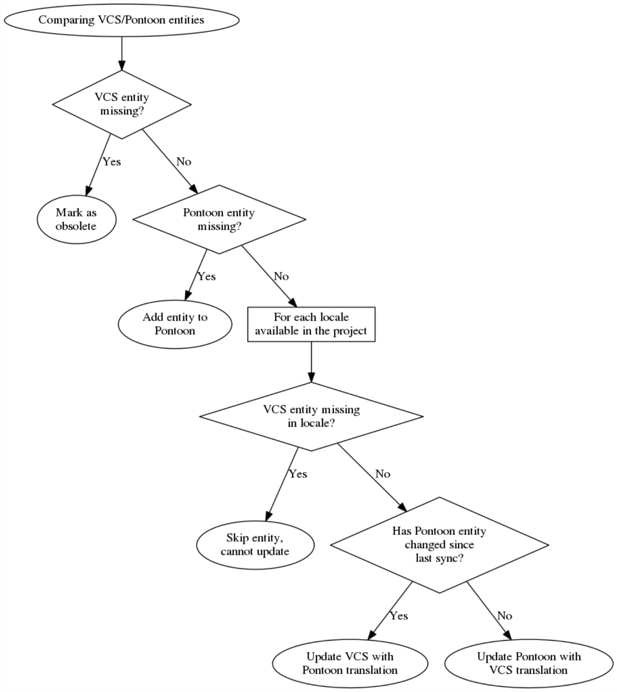

# Translation Sync

At it's core, Pontoon is a user interface for editing translations that are
stored in a version control system. Because Pontoon does not directly edit the
VCS files whenever a user submits a translation, it has to maintain a database
of what it thinks the translated strings are. And, periodically, it has to sync
with version control to pull newly-submitted strings and translations committed
directly, as well as to write its own changes back.

This document describes that sync process in detail.

## Triggering a Sync

Pontoon is assumed to run a sync once an hour, although this is configurable.
When a sync is triggered, Pontoon finds all projects that are not marked as
disabled within the admin interface and schedules a sync task for each one.
Sync tasks are executed in parallel, using [Celery](http://www.celeryproject.org/)
to manage the worker queue.

## Syncing a Project

Syncing an individual project is split into two tasks. The first one is syncing
source strings:

- Pull latest changes of the source string repository from version control.
- Check for changes in VCS and in Pontoon, and if there are no changes in VCS
  and Pontoon and the project only uses one repository, skip syncing the
  project completely.
- If source repository has changed since the last sync, reflect any added,
  changed or removed files in Pontoon.

The second step is syncing translations:

- Pull latest changes of all project repositories from version control.
- Check for changes in VCS and in Pontoon, and if there are no changes in VCS
  and Pontoon, quit early.
- If there are changes, identify which files have changed and find all their
  entities, searching both the Pontoon database and VCS.
- For each entity found, compare the VCS version to the Pontoon version (also
  known as the database version) and decide how to sync it. These changes are
  collected in a "Changeset" object.
- Once all the entities are compared, execute the changes in the Changeset.
- Commit any changes made in the filesystem back to the VCS. If there are no
  changes, no commit is made.
- Clean up leftover information in the database.

## Comparing Entities

The heart of the syncing process is comparing an entity stored in Pontoon's
database with its matching entity in the resource file in VCS and modifying both
the database and the VCS file so that the two are in sync. It's this process
that determines when to update VCS with a submitted translation from Pontoon vs.
when to update Pontoon with a translation from VCS, as well as other possible
actions.

The comparison takes into account:

- Whether an entity exists in the Pontoon database or VCS. VCS may be missing an
  entity due to a developer removing the source string, or Pontoon may be
  missing an entity due to a new string being added to VCS.
- Whether a specific locale in VCS has an entity that Pontoon can update.
- Whether an entity has changed in the Pontoon database since the last sync.
  This tracks if translations for an entity have been updated or deleted since
  the last time Pontoon synced.

The actual comparison logic goes something like this:

## Executing Changes

Entity comparison produces a Changeset, which is used to make the necessary
changes to the database and resource files.

Changesets can perform 4 different operations on an entity:

**Update Pontoon from VCS**

   &emsp;Add a translation from VCS to Pontoon if necessary. Existing translations
   that match the VCS translation are re-used, and all non-matching translations
   are marked as unapproved.

**Update VCS from Pontoon**

   &emsp;Add a translation from Pontoon to VCS, overwriting the existing translation
   if it exists.

**Create New Entity in Pontoon**

   &emsp;Create a new entity in the Pontoon database, including the VCS translation if
   it is present.

**Obsolete Pontoon Entity**

   &emsp;Mark an entity in the database as obsolete, due to it not existing in VCS.
   The entity will no longer appear on the website.

When possible, Changesets perform database operations in bulk in order to speed
up the syncing process.
