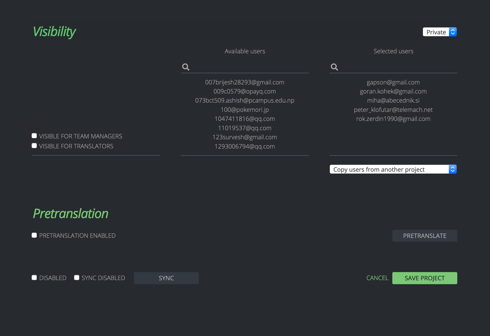

- Feature Name: Private Projects
- Created: 2020-02-10
- Associated Bug: https://bugzilla.mozilla.org/show_bug.cgi?id=1602490

# Summary

Add an option to make a project "private", restricting who can see it and interact with it.

# Motivation

It can be useful in some cases to be able to hide a project from users. For example, when a project manager creates a new project, they might want to make sure that everything is correctly set up before exposing it — running sync, verifying that it is enabled for the right locales, etc. In such a case, the project being hidden from everyone but project managers is enough. Once the project manager is done with configuration, they simply make the project public.

For a different use-case, let's consider an agency working with several clients. They have a number of projects created on Pontoon, and they want to have specific localizers working on specific projects. It would be beneficial for them to be able to restrict seeing a project to only a defined list of users. This requires being able to mark a project as private, and also having a configuration option to select a list of users who will be able to see, and interact, with that project. That would allow for a clear separation of projects, reducing the risk of localizers translating the wrong set of projects.

# Feature explanation

When creating or editing a project, a superadmin has two new options:

- a simple selectbox to make the project private or public (private by default);
- a "selected users" formset controlling which users can see the project when it is private.

The formset is only visible when the project is marked as private. It has four elements:

- a list of users, showing who currently has access (or will upon saving). Clicking a user in the list removes that user from the list;
- a search input, used to look for a specific user in the database and adding that user to the list;
- a "copy from project" button, allowing to copy the selected users list from an existing project;
- checkboxes to grant team managers and translators access, even if they are not among the selected users.

On the administration page of a project that is marked as private, we show a warning that the project is private and must be made public to enable translation by all users.

On each dashboard listing projects (`/projects/`, `/{locale}/`), private projects will not appear unless the user has access. Private projects will not appear on the Permissions tab of the team dashboard (`/{locale}/permissions/`).

Pages related to a project (`/projects/{project}/`, `\{locale}/{project}/`, `/{locale}/{project}/{resource}/`) will return a 404 Not Found error unless the user has access. That should also be the case for back-end endpoints used to modify data, as the user should not be able to interact at all with a private project unless they have access.

All instances of the "latest activity" feature, throughout the website, should also filter out private projects inaccessible to the user. However, data from private projects doesn't need to be removed from Translation Memory. Those projects would be private but not "secret", so it's fine if data is exposed, as long as only a defined set of people can create and modify that data.

# Roles

| Role | Impact |
| -- | -- |
| Project Manager | Can see all projects |
| Team Manager | Can see public projects and private projects "Visible for Team Managers" |
| Translator | Can see public projects and private projects "Visible for Translators" |
| Contributor | Can see public projects and private projects for which they are selected |

# Drawbacks

This feature risks creating confusion amongst users for Pontoon instances that are usually open to all users (like Mozilla's). It can happen if some users of a local community have access to a project, and others do not. In such instances, private projects should be used only for the sake of configuration, after what they should always be public or marked as disabled.

# Mockup

