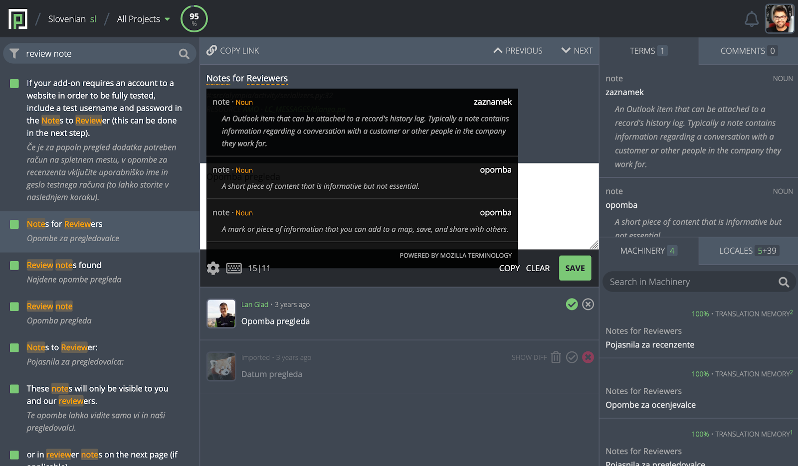

- Feature Name: Terminology Presentation
- Created: 2020-03-24
- Associated Bug: https://bugzilla.mozilla.org/show_bug.cgi?id=1624557

# Summary

Terminology is a group of specialized words, compound words or multi-word expressions (terms) relating to a particular field. This feature adds the ability to store such terms in Pontoon, identify them in original strings and present them in the translation workbench.

# Motivation

- **Improving translation consistency**: it’s hard to expect all authors to always use the same translations for the same words and phrases without any help from the tool.
- **Speeding up translation process**: localizers need to manually search for existing translations of terms found in the strings they are translating.
- **Fixing brand translations**: trademarks present a special case for localization as they have legal and semantic significance.

# Out of scope

- **Terminology creation**: the ability to manually add, remove and review terms.
- **Terminology translation**: the ability to manually add, remove and review term translations.
- **VCS intergration**: the ability to sync terminology with VCS.
- **Checks**: the ability to check if translations include term translations.

# Feature explanation

As the first step, we need the ability to store terms in the database. Data model should allow for importing terms stored in a TBX file and the [initial Mozilla term list](https://docs.google.com/spreadsheets/d/1MAPD8WBnstR6pwKbNEDKOpw5CTPnl3qAobDgomdmtdY/edit?ts=5e79126c#gid=1146590716).

At least the following information needs to be saved for each term:
- term itself
- part of speech
- definition
- usage
- translations (separate table)

Next, we need to identify stored terms in any original string used in translation workbench. We should take into account that terms can take various grammatical forms when used in strings and use tokenization and stemming to mitigate that.

Terms should be highlighted in the original string, similarly to how we highlight placeables. On term hover, a popup should appear with a list of matching terms and the corresponding metadata (description, part of speech and translation, if exists). On click, translation of the first term should be inserted into the editor.

Aditionally, we could also introduce the Terminology panel in the 3rd column, next to Machinery, Locales and Comments. It would allow translators to see terms and the corresponding metadata all the time, without the need to hover. Translations of terms (if exist) would be inserted into the editor on click.

# Mockup

