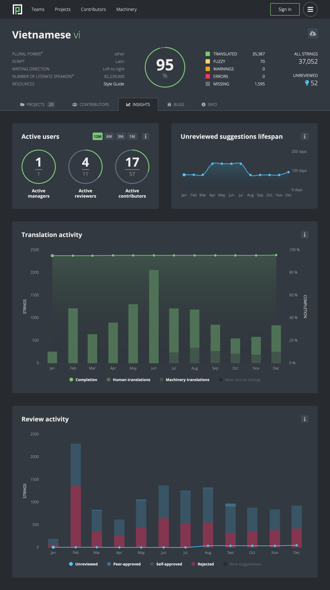

- Feature Name: Community Health Dashboard
- Created: 2020-10-23
- Associated Bug: https://bugzilla.mozilla.org/show_bug.cgi?id=1672966

# Summary

Create a team-specific health dashboard targeted at Pontoon users with Manager rights.

# Motivation

Team managers as well as project managers should have the ability to understand engagement of the localization communities. Team dashboards already provide some of the answers, including the overall status of completion and translation statistics, but the information is only available in the form of a current snapshot.

There's no historic data to provide insights into how the community health is developing. Missing is the information on how completion and volume of unreviewed strings are changing over time. It's not clear what share of translations was copied from the Machinery. We also don't know the ratio of translations approved without a peer review.

# Out of scope

At this stage we’re only interested in presenting data we already collect in Pontoon. We're primarily focusing on exposing data to team managers; project managers will be able to obtain data across all teams if needed, e.g. by using scripts and the API.

# Feature explanation

A new "Insights" tab is made available on the Team page, positioned next to the "Contributors" tab. It consists of several sections, presenting data for the period of the last 12 months. Each section is described below. Detailed description of each chart appears when hovering over the info icon. Fore more details about the design, see the [Mockup](#mockup) section.

## Active users

Pie charts showing ratios of active vs. all managers, reviewers and contributors. See the existing scripts ([1](https://github.com/flodolo/scripts/blob/954fa85/pontoon/active_contributors.py), [2](https://github.com/flodolo/scripts/blob/954fa85/pontoon/list_reviewers_with_contribution_stats.py)) for criteria of defining active users and for details on how to retrieve data. Active managers are managers who logged into Pontoon within a selected time frame.

## Unreviewed suggestion lifespan

A line chart showing time before suggestion gets approved or rejected. See the [existing script](https://github.com/flodolo/scripts/blob/954fa85/pontoon/unreviewed_suggestions_lifespan.py) for details on how to retrieve data. A tooltip showing the exact data at a given time appears when hovering over a chart.

## Translation activity

A combination of a line chart showing completion over time and a column chart showing approved translation submissions in a stack of two columns - human translations (`Translation.machinery_sources` not set) and Machinery translations (`Translation.machinery_sources` set). Source string additions are plotted in a separate column, which is hidden by default. A tooltip showing the exact data and ratios at a given time appears when hovering over a chart.

## Review activity

A combination of a line chart showing the number of unreviewed suggestions over time and a column chart showing review actions in a stack of three columns - peer-approvals, self-approvals and rejections. Suggestion submissions are plotted in a separate column, which is hidden by default. The review actions column is A tooltip showing the exact data and ratios at a given time appears when hovering over a chart.

See the [existing script](https://github.com/flodolo/scripts/blob/954fa85/pontoon/self_approval_ratio.py) for calculating self-approval ratio.

# Retrieving data

Data doesn't need to be calculated on the fly. A (daily) cron job gathers all the required data for plotting charts and stores it in the DB. A data migration is used for gathering data for the past 12 months.

We already have scripts for retrieving most of the data (linked in the [Feature explanation](#feature-explanation) section). For the rest, the ActivityLog model is used as much as possible for improved performance over e.g. Translation and Entity models.

# Mockup

