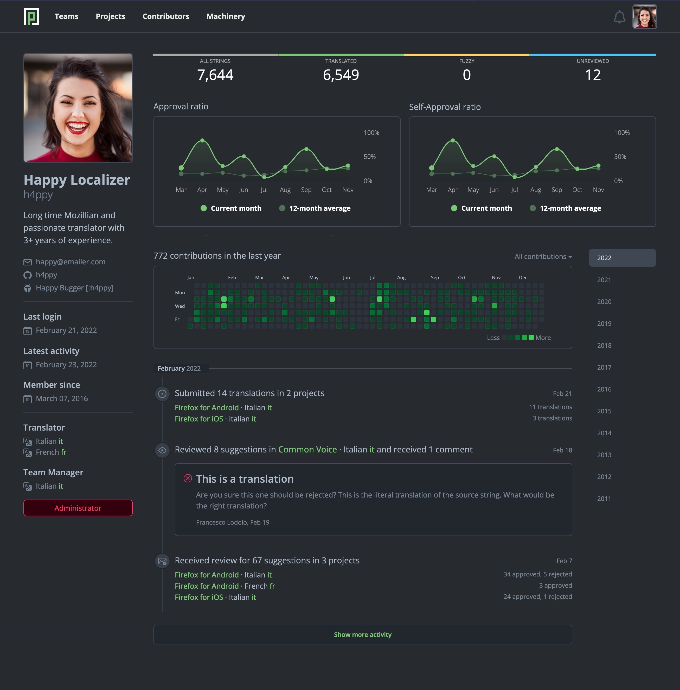

- Feature Name: Redesign of the Profile Page
- Created: 2022-03-30
- Associated Issue: #2028, #2203, #2112

# Summary

Redesign the profile page to better serve both users and administrators by making data about contributions and contact information easy to access.

# Motivation

The current profile page only provides minimal information on a contributor. The timeline is not interactive and shows only some of the translations, forcing someone interested in knowing more about specific contributions to manually search for them in Pontoon.

Contributors should be able to find all the information about their work in the profile page, and use it to promote themselves internally, e.g. to ask locale managers or administrators for translator permissions, and externally, e.g. to prove their experience as a volunteer. Their contributions should be easily accessible through links in the profile page.

Locale managers and administrators should be able to determine the quality of contributions from the profile page, and find all the relevant contact information to get in touch.

# Feature explanation

See the [mockup](#mockup) for the overall view. Each of the following sections provides more details on different parts of the design.

## Approval ratio

Displayed in a graph, it’s the ratio between the number of translations approved over the total number of translations reviewed, excluding self-approved (either submitted directly as translations, or provided as suggestions and later approved by the translator) and self-rejected translations.

Examples:
* If a person submits 110 translations, of which 20 are rejected and 10 unreviewed, the approval ratio will be 80%.
* If a person submits 100 translations, 20 are rejected, 20 are self-approved, the approval ratio will be 75% (60 over 80).

The graph displays both the specific month’s ratio and the average for the previous 12 months.

## Self-approval ratio

Displayed in a graph, it’s the ratio between the number of translations submitted directly — or self-approved after submitting them as suggestions — over the total number of translations approved. This data point is meaningful only for users with translator rights (translators, locale managers), as it will always be 0 for contributors.

Example: if a person has 100 approved translations, but 60 are self-approved, the self-approval ratio will be 60%.

The graph displays both the specific month’s ratio and the average for the previous 12 months.

## Contribution graph

The contribution graph displays data over time about the following actions:
* `Submissions`: translations submitted, including both suggestions and direct translations.
* `Reviews performed`: reviews performed on pending suggestions.
* `Reviews received`: reviews received from another translator.
* `Submissions and reviews`: submissions + reviews performed.
* `All activities`: submissions + reviews performed + reviews received.

Only one data point is displayed at a time, and it can be selected using the dropdown list above the graph. The default view is `Submissions and reviews`, since it provides a good picture of the user’s direct activity in Pontoon.

Each square in the graph represents a day, with color changing depending on the amount of contributions. It’s possible to click on a column to select a specific week, or change the year currently displayed using the links in the rightmost column.

When selecting a specific time range, the data displayed below the graph is updated accordingly. This doesn’t affect the approval and self-approval graphs.

## Latest activity

*Latest activity* is displayed in the sidebar. A user is considered active when they either submit a suggestion or review someone else’s work. It’s not considered activity:
* Logging in to Pontoon.
* Writing a comment.

## Other data in the sidebar

The sidebar displays contact information for the contributor:
* Name.
* Bio.
* Email address.
* External accounts.
* Last login.
* Latest activity.
* Join date (header `Member since`).
* Translation rights (header `Translator`), followed by a list of locales for which the user has translator rights. The section is hidden if the user doesn’t have translator rights.
* Locale manager rights (header `Team  Manager`), followed by a list of locales for which the user has manager rights.
* A flag indicating if the user is an administrator. The section is hidden if the user doesn’t have manager rights.

## Visibility of data

Most of the data will always be visible to all users, including users not logged in to Pontoon.

Visibility of the following fields can be configured by users:
* Email address (default: users with translator rights only, option: logged in users).
* External accounts (default: users with translator rights only, option: all users).
* Self-approval ratio (default: all users, option: users with translator rights only).
* Approval ratio (default: all users, option: users with translator rights only).

Note: The email addresses of managers and administrators will always be visible to all logged in users, since contributors need to be able to contact them.

## Dependencies and other changes

### Email address

Users should be able to provide a *contact email address* that will be displayed in the profile page. If not provided, the email address associated to the account used to log in to Pontoon will be displayed.

### External accounts

Users should be able to provide a series of external accounts to help locale managers and administrators contacting them:
* Bugzilla (email address).
* GitHub (username).
* Matrix (username).

### Vanity URL

In order to share a profile more easily, users should be able to set up a vanity URL — a unique identifier, easier to remember, that can be used in the URL instead of the random ID assigned by Pontoon.

# Mockup

