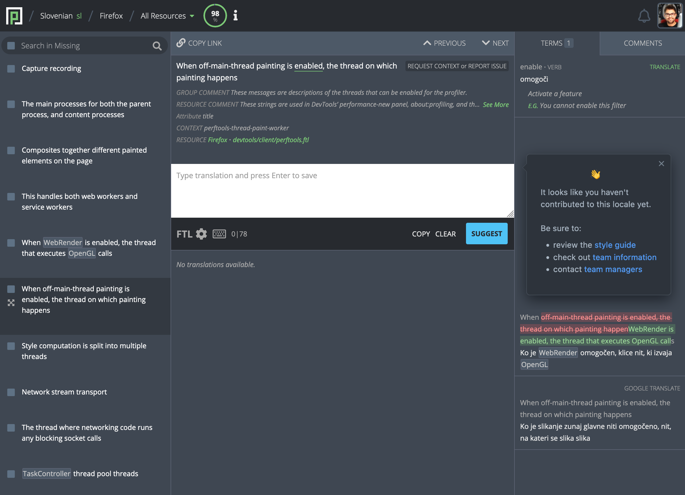

- Feature Name: Team guidelines for new contributors
- Created: 2022-05-31
- Associated Issue: #2305

# Summary

Provide new contributors with guidelines before making their first contribution to a team.

# Motivation

It has been suggested on various occasions and from various sources, including at the localizer workshops, that the onboarding experience for new contributors needs improvements.

Pontoon homepage and tour lead users towards making their first contribution, but don't provide any team-specific information.

On top of that, new users don't get connected with their team, and team managers don't get any explicit information about new contributors joining their teams.

# Feature explanation

## Translate view tooltip

Before users submit their first suggestion to a particular team, a tooltip appears near the text editor, with the following content:

It looks like you haven't contributed to this locale yet.

Make sure to check the <a href="/locale-code/info">team information</a> page before starting, as it might contain important information and language resources.

If you want to contact the team managers, check out the <a href="/locale-code/contributors">team contributors</a> page.

## Notification for team managers

After users submit their first suggestion to a particular team, an in-app notification is sent to team managers, informing them about the new user. Example text:

John Smith has made their first contribution to Locale X (locale-code). Please welcome them to the team!

# Prerequisites

1. Before launch, we give locale managers a heads-up of how the Team Info tab content will be used in the new feature and offer them an opportunity for any updates.

2. [Group contributors by role](https://github.com/mozilla/pontoon/issues/2157) in the Team Contributors page.

# Mockup

Please note that the text in the bubble might be out of date. The canonical version is specified above.

