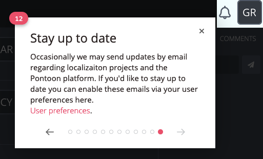

- Feature Name: Email user consent
- Created: 2022-08-08
- Associated Issue: #ISSUE-ID

# Summary

Implement user consent for email communication and Pontoon messaging to encourage new and existing users to review their preference.

# Motivation

There does not exist currently an email communication consent opt-in for users who register with Pontoon. This restricts the ability to reach users outside of the platform, for example users who have not logged-in for some time, and reduces our effectiveness in keeping localizers informed and engaged.

In addition, this will allow us to reach out within legal compliance to the wider audience of registered users for things such as surveys, etc. Future major platform enhancements will be able to build off this work, and starting this early will provide enough time to ensure interested and active contributors are opted-in ahead of time.

Value for users / problems solved  
- Users can select their preference for email communication
- Engagement/reach expanded beyond logged-in active Pontoon users

# Feature explanation

## Email communications user setting
Within the user settings, a new "Email communications" section is added, with the following content:

(Section: content)
- Header: "Email communications"
- Opt-in check box: (displays users saved preference, users are opted-out by default)
- Opt-in check box label: "Receive email updates related to the localization of projects on Pontoon and updates on the Pontoon platform. I’m okay with Mozilla handling my personal information as explained in <a href="https://www.mozilla.org/en-US/privacy/websites/">this Privacy Notice</a>."

User email communication preference is stored and referenced to determine if emails should be sent to user.

## Banner notification to existing users

We need to make existing users aware of the new email communication preference. 

A banner should be displayed to existing users logging in for the first time after the feature is enabled.

(Section: content)
- Button (dismiss banner): "x"
- Text: "Stay up to date on your localization projects and Pontoon!"
- Button: "Enable email updates"
- Consent: “By enabling email updates, I’m okay with Mozilla handling my personal information as explained in this Privacy Notice. This can be changed at any time in your settings."

## New account creation email opt-in

Ideally, we would like users to set up their email communication preferences right away upon successful account creation.

After a user successfully creates their Pontoon account, display a standalone page which redirects to the homepage after the user enables or rejects email updates. This page informs the user of successful account creation and request for updating email communication preferences.

(Section: content)
- Header: "Welcome to Pontoon!"
- Sub-header: "You have successfully created your Pontoon account."
- Body: "Would you like to stay up to date on the localization of your projects and receive Pontoon updates by email? This can be changed at any time in your settings."
- Button: "Enable email updates”
- Button: "No, thank you"
- Opt-in check box:
- Consent: “By enabling email updates, I’m okay with Mozilla handling my personal information as explained in <a href="https://www.mozilla.org/en-US/privacy/websites/">this Privacy Notice</a>. This can be changed at any time in your settings."

## Additional card for tour

As part of new user onboarding, point new users to user preferences and call out the ability to enable emain communication preferences.

(Section: content)
- Header: Stay up to date
- Body: "Occasionally we may send updates by email regarding localization projects and Pontoon. If you'd like to stay up to date, you can enable these emails in your settings."

*Display if user logged in*
- Button: "Enable email updates"
- Consent: “By enabling email updates, I’m okay with Mozilla handling my personal information as explained in this Privacy Notice. This can be changed at any time in your settings."

# Prerequisites

1. Copy to be reviewed by legal before launch.

# Mockups

Mockups below are out of date. The canonical version is specified above.

## Email communication user setting

## Banner notification to existing users

## New account creation email opt-in

## Additional card for tour

