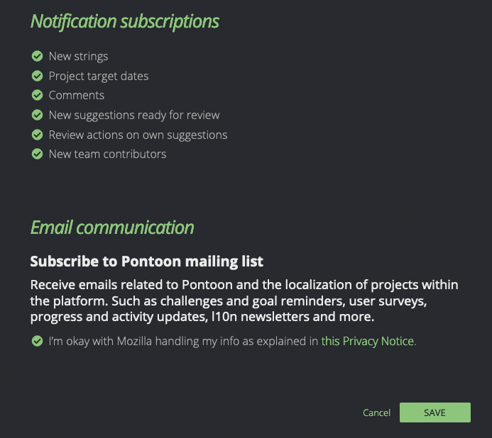
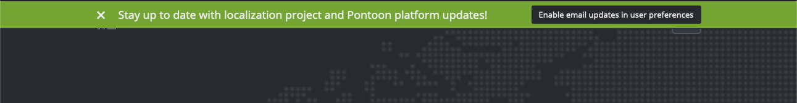
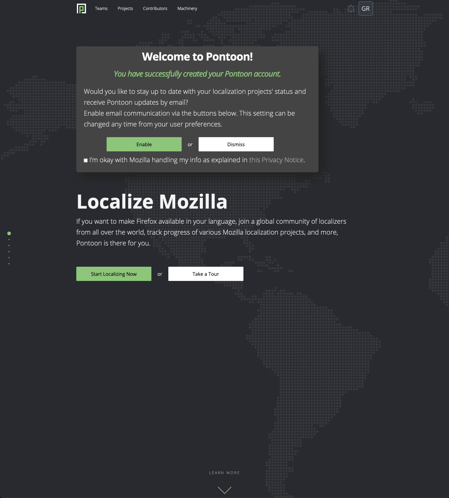

- Feature Name: Email user consent
- Created: 2022-08-08
- Associated Issue: #ISSUE-ID

# Summary

Implement user consent for email communication and Pontoon messaging to encourage new and existing users to review their preference.

# Motivation

There does not exist currently an email communication consent opt-in for users who register with Pontoon. This restricts the ability to reach users outside of the platform, for example users who have not logged-in for some time, and reduces our effectiveness in keeping localizers informed and engaged.

In addition, this will allow us to reach out within legal compliance to the wider audience of registered users for things such as surveys, etc. Future major platform enhancements will be able to build off this work, and starting this early will provide enough time to ensure interested and active contributers are opted-in ahead of time.  

Value for users / problems solved
- Users can select their preference for email communication
- Engagement/reach expanded beyond logged-in active Pontoon users

# Feature explanation

## Email communication user setting
Within the user settings, a new "Email communications" section is added, with the following content:

(Section: content)
- Header: "Email communication"
- Sub-header: "Subscribe to Pontoon mailing list"
- Body: "Receive emails related to Pontoon and the localization of projects within the platform. Such as challenges and goal reminders, user surveys, progress and activity updates, l10n newsletters and more."
- Opt-in check box: (displays users saved preference, users are opted-out by default)
- Opt-in check box label (consent text): "I’m okay with Mozilla handling my info as explained in <a href="https://www.mozilla.org/en-US/privacy/websites/">this Privacy Notice</a>."

User email communication preference is stored and referenced to determine if emails should be sent to user.

## Banner notification to existing users

We need to make existing users aware of the new email communication preference. 

A banner should be displayed to existing users logging in for the first time after the feature is enabled/

(Section: content)
- Button (dismiss banner): "x"
- Text: "Stay up to date with localization project and Pontoon platform updates!"
- Button: "Enable email updates in user preferences"

## New account creation email opt-in

Ideally, we would like users to set up their email communication preferences right away upon successful account creation.

After user successfully creates their Pontoon account, display a popup on the redirected page (Pontoon main page) that informs user of successful account creation and request for updating email communication preferences.

(Section: content)
- Header: "Welcome to Pontoon!"
- Sub-header: "You have successfully created your Pontoon account."
- Body: "Would you like to stay up to date with your localization projects' status and receive Pontoon updates by email? Enable email communication via the buttons below. This setting can be changed any time from your user preferences."
- Button: "Enable"
- Button: "Dismiss"
- Opt-in check box:
- Opt-in check box label (consent text): "I’m okay with Mozilla handling my info as explained in <a href="https://www.mozilla.org/en-US/privacy/websites/">this Privacy Notice</a>."

# Prerequisites

1. Copy to be reviewed by legal before launch.

# Mockups

Please note that the text in the bubble might be out of date. The canonical version is specified above.

## Email communication user setting

## Banner notification to existing users

## New account creation email opt-in

