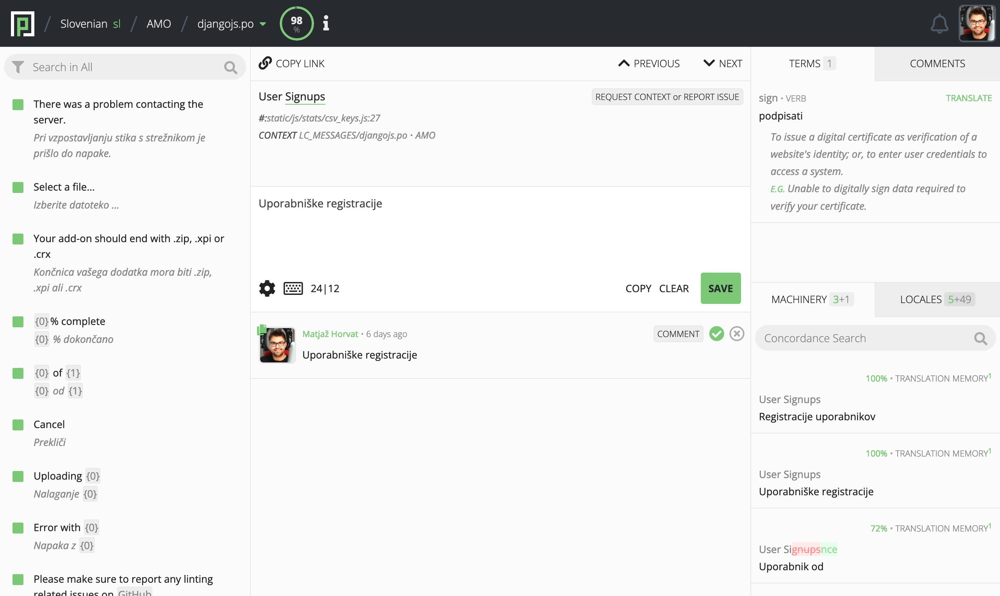
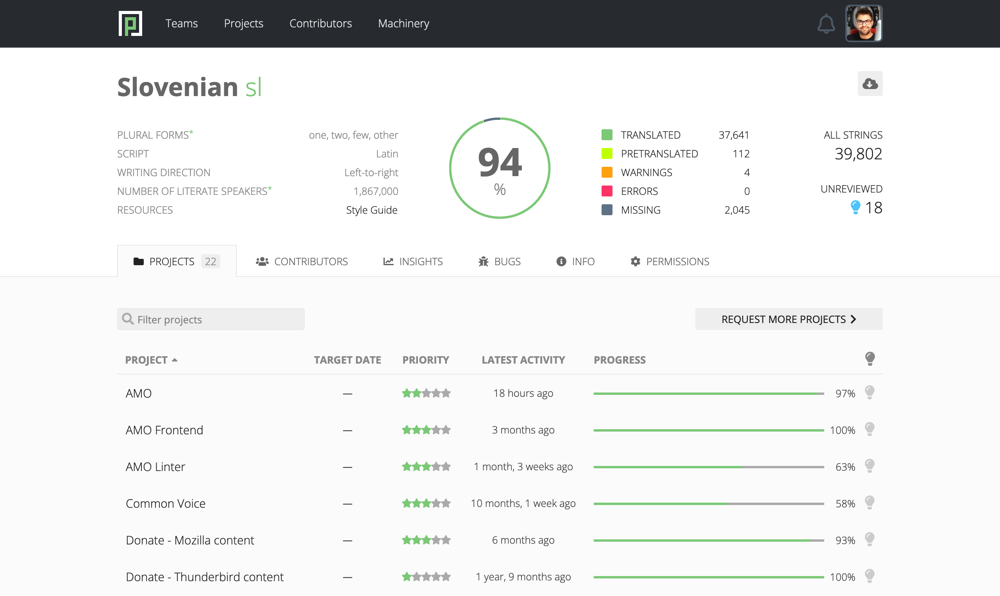

- Feature Name: Light theme
- Created: 2023-06-22
- Associated Issue: #2141

# Summary

Implement light theme and enable users to switch between the (current) dark theme and the light theme.

# Motivation

Over the years, many users have expressed preference for a light color theme over the Pontoon default dark theme. Having the ability to switch themes will also allow us to implement high contrast themes, which benefit low vision users, increase readability and reduce website’s visual noise.

# Feature explanation

Users are able to switch between themes in their settings. Each theme is represented with a title and a radio box. As soon as the theme is selected, it gets applied and the settings get saved. The default theme is the dark theme.

A "Sync with system theme" checkbox allows users to let the browser pick the theme from the OS setting using the [prefers-color-scheme](https://developer.mozilla.org/en-US/docs/Web/CSS/@media/prefers-color-scheme) CSS media feature.

# Implementation notes

In the first step, we'll replace existing hardcoded color values with CSS variables. We'll store those in separate CSS files, with one version of each file for each theme.

# Main color pairs

The following is a non-exhaustive list of color transformations between the dark and the light theme:

* Main background color: #3f4752 -> #fbfbfb
* Highlighted area background color: #333941 -> #eee
* Button background color: #333941 -> #eee
* Input box background color: #333941 -> #eee
* Inactive tabs background color: #4d5967 -> #eee
* Main border color: #5e6475 -> #e8e8e8
* Source string font color: #fff -> #222
* History and Machinery font color: #ebebeb -> #222
* Sidebar translation font color: #aaa -> #888
* Machinery source string font color: #aaa -> #888
* Metadata value front color: #aaa -> #888
* Metadata title front color: #888 -> #888
* Icons color: #aaa -> #aaa

# Mockup

*Translate View*

*Team Dashboard*
