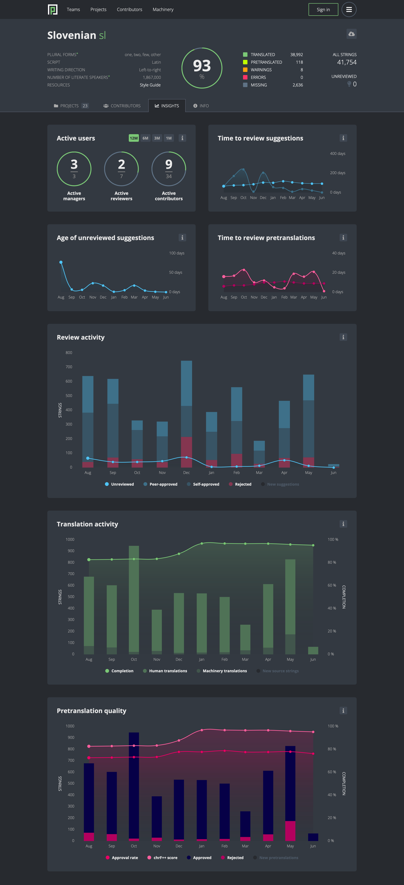

- Feature Name: Pretranslation Monitoring
- Created: 2023-07-05
- Associated Issue: #2894

# Summary

Extend Insights dashboards with the ability to continuously monitor quality of pretranslations across locales and projects.

# Motivation

As part of the pretranslation feature testing with a limited number of locales, we used [scripts](https://github.com/mozilla-l10n/pontoon-scripts/tree/main/stats/pretranslation) to generate [evaluation sheets](https://docs.google.com/spreadsheets/d/1CH7s-ykyAq9G6vf4qizvzGUsD9pamWAM04BOOIlZzac/edit#gid=610852174) that were used to track performance of the pretranslation feature across participating locales and projects.

Since the feature is now ready for larger adoption, we'd like to automate the process of collecting the data about pretranslations and show it on the dashboards. That will allow PMs to see which locales struggle with the review performance, which projects are not a good fit for pretranslation, and to make decisions accordingly.

# Feature explanation

## New charts on the Insights tabs

A new "Time to review pretranslations" chart is made available under the "Time to review suggestions" chart in the Team Insights page. It's a line chart displaying two separate data points over the last 12 months:
* *Current month*: Average age of pretranslations reviewed during the specific month.
* *12-month average*: Average age of pretranslations reviewed in the 12 months before the specific month.

**Text for infobox**: *How much time it takes on average to review a pretranslation.* The above bullet points should be added to the infobar to describe the plotted data points.

A new "Pretranslation quality" chart is made available at the bottom of the (Team, Project and Project-Locale) Insights pages, presenting data for the period of the last 12 months. It is a combination of three charts:

1. A column chart showing pretranslation review actions over time in a stack of two columns - approvals and rejections of pretranslations. Approvals and rejections performed by sync are excluded. New pretranslations are plotted in a separate column, which is hidden by default.
1. A line chart showing the percentage of approved pretranslations over time.
1. A line chart showing the chrF++ score over time.

**Text for infobox**: *Approval rate and chrF++ score of pretranslations.*

Time to review suggestions and Age of unreviewed suggestions charts are split into separate panels in order to accomodate the new layout. Fore more details about the design, see the Mockup section.

## New Insights page

A new Insights page is made available at `/insights`. It consists of two charts, presenting data for the period of the last 12 months.

"Team Pretranslation quality" chart contains one line chart per team, showing the percentage of approved pretranslations over time for the given team. Aggregate line chart shows data across all teams. Each line can be toggled.

**Text for infobox**: *Approval rate of pretranslations for each team.*

"Project Pretranslation quality" chart contains one line chart per project, showing the percentage of approved pretranslations over time for the given project. Aggregate line chart shows data across all projects. Each line can be toggled.

**Text for infobox**: *Approval rate of pretranslations for each project.*

## For all charts:

- A tooltip showing the exact data at a given month appears when hovering over a chart.
- Detailed description of the chart appears after clicking on the info icon.
- Data is available for each day, but aggregated by month in the chart.
- A (daily) cron job gathers all the required data for plotting and stores it in the DB.
- A data migration is used for gathering past data.

# Out of scope

Sending alerts (e.g. as weekly emails to the Pontoon Team mailing list) with a list of locales that fall behind the acceptance criteria is not covered by this feature.

# Mockup

