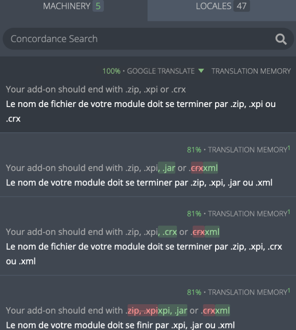

- Feature Name: LLM-Assisted Translations in Pontoon
- Created: 2024-01-12
- Associated Issue: #3064

# Summary

Introduce LLM-assisted translations in Pontoon to provide alternative translations, including formal and informal options, with the goal to enhance translation quality.

# Motivation

Modern Large Language Models (LLMs) — like OpenAI’s GPT-4 — have reached a quality level for localization tasks that is on par with dedicated machine translation engines. This feature is primarily focused on introducing a tool that aims to improve translation quality in Mozilla's projects. By incorporating LLM-assisted translations, Mozilla not only remains competitive with other Translation Management Systems (TMS) providers but also embraces new technologies to enhance the overall translation process. This feature also lays the groundwork for future integrations that could further enhance efficiency and broaden the scope of translation improvements within Mozilla's localization efforts.

# Feature explanation

In the Machinery tab of the Pontoon translate view, users will encounter a new drop-down option for each machine translation suggestion for a given string, initially offering three choices: 

1) `MAKE INFORMAL` - Provide a more informal version of this translation 
2) `MAKE FORMAL` - Provide a more formal version of this translation
3) `REPHRASE` - Provide an alternative to this translation 

Upon selecting any of these options, the original machine translation will temporarily show `AI is writing` as the LLM generates the new translation. This revised translation will then appear in place of the original suggestion. Once a new translation is generated, another option `SHOW ORIGINAL` will be seen in the drop-down menu. Users can revert to the original translation by selecting the `SHOW ORIGINAL` option from the drop-down menu. 

Additionally, after selecting an option from the drop-down menu, the label beside the drop-down arrow will change as follows:
- `MAKE INFORMAL` -> `INFORMAL`
- `MAKE FORMAL` -> `FORMAL`
- `REPHRASE` -> `REPHRASED`
- `SHOW ORIGINAL` -> Reverts to the initial drop-down state

# Implementation notes

The translation enhancement options will utilize OpenAI’s GPT-4 API to improve the existing machine translation suggestions. This is especially useful for accurately translating challenging phrases, like idiomatic expressions, by utilizing the LLM's capability to adapt translations to the specific style and nuances of the target language.

Additionally, data on the frequency of LLM usage and the adoption rate of LLM-provided translations will be collected to assess the tool's impact and refine its capabilities. This will include identifying additional machinery sources to better understand which aspects of the tool are most utilized. Furthermore, we will log user experience (UX) actions for each selection made in the drop-down menu.

The implementation will be divided into several subtasks:
1. API integration to facilitate interaction between Pontoon and the GPT-4 API, and logic to utilize machine translation as an input.
2. Implement the ability to provide alternative translation suggestions and to adjust translations for formality.
3. Frontend implementation for the new features.
4. Gather feedback, refine UI/UX, and fix any issues encountered.

# Mockup

*Initial drop-down menu*

*Collapsed drop-down menu*

*"Rephrase" option is selected*

*Updated translation*