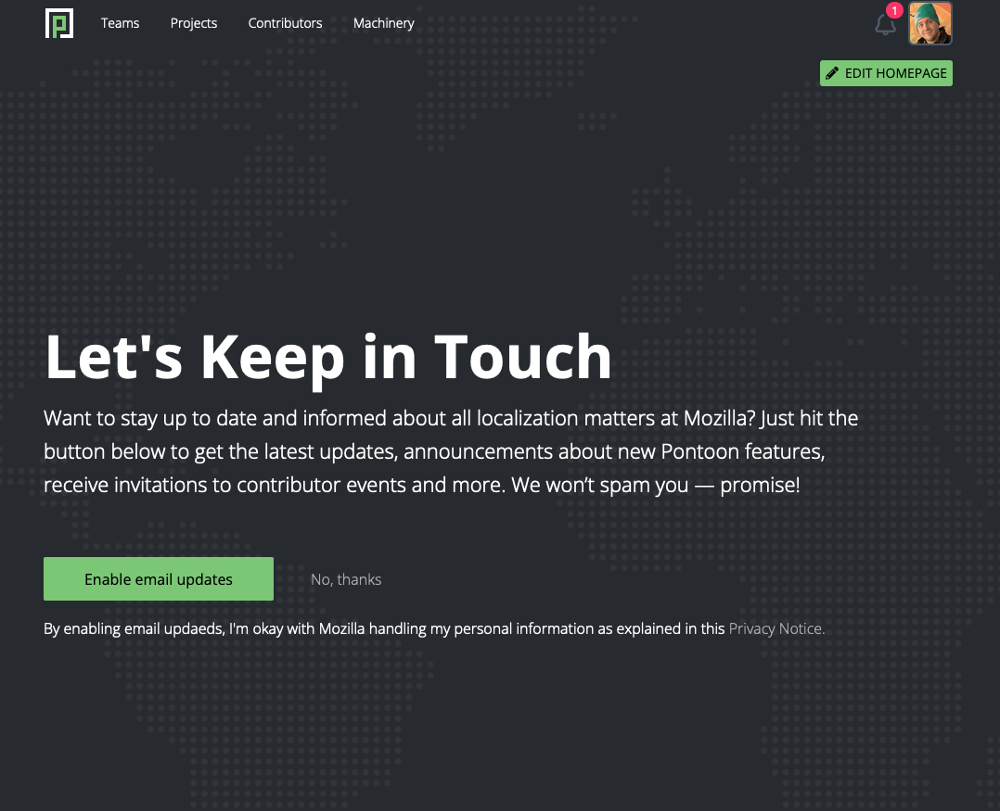

- Feature Name: Email opt-in consent and Unsubscribe page
- Created: 2024-02-21
- Associated Issue: #3109

# Summary

Work required to enable email communication with Pontoon users: opt-in consent user settings, methods for collecting user opt-in, unsubscribe method via a single page that doesn't require login.

# Motivation

The ability to opt in to non-transactional email communications does not currently exist for users who register with Pontoon. This restricts our ability to reach contributors outside of the platform and reduces our effectiveness in keeping localizers informed and engaged. So we need to create settings that allow users to control their ability to opt in to email messages.

This will allow us to reach out within legal compliance to the wider audience of registered users for things such as surveys, online events, etc. Future major platform enhancements can build off this work, and starting early will provide enough time to ensure interested and active contributors are opted-in ahead of time.

Value for users / problems solved:
- Users can select their preference for email communication
- Engagement/reach that respects user preferences and complies with legal requirements
- Expands the types of information and messaging we can send to community members beyond what can be included in transactional emails

# Feature explanation

## Email communication user settings

The email opt-in consent option is available under the new “Email communications” option in user settings. “Contact email address” is moved from the "Personal information" section to this section.

These user email communication preferences are stored and referenced in database to determine if emails should be sent to the user.

(Section: content)
- Section title: `Email communications`
- Input field: `Contact email address`
- Subtitle of input: `If provided, this email address will be used for email communications and will appear under your Profile page instead of the email used for login.`
- Check box: `Receive the latest updates about localization at Mozilla, announcements about new Pontoon features, receive invitations to contributor events and more.`
- Subtitle to check box: `I’m okay with Mozilla handling my personal information as explained in this <a href="https://www.mozilla.org/privacy/websites/">Privacy Notice</a>.`

Note: All texts need to configurable per instance, i.e. we should not be hard-coding "Mozilla".

## Standalone page for email opt-in consent shown after existing user login

We need to make existing users aware of the new email communication preference.

Upon accessing Pontoon for the first time after the feature is enabled, an email opt-in consent page is displayed to existing users.

The user selects their preference by clicking one of two buttons, one to opt in to emails or one declining to opt in. This page is not shown again if the user clicks either of the buttons. The page is shown again on their next visit if the user navigates away from the page without clicking either of the buttons.

This page is not shown if the user has already opted in via their settings.

(Section: content)
- Header: `Let’s Keep in Touch`
- Paragraph: `Want to stay up to date and informed about all localization matters at Mozilla? Just hit the button below to get the latest updates, announcements about new Pontoon features, receive invitations to contributor events and more. We won’t spam you — promise!`
- Button (primary): `Enable email updates`
- Button: `No, thanks`
- Privacy Notice: `By enabling email updates, I’m okay with Mozilla handling my personal information as explained in this <a href="https://www.mozilla.org/privacy/websites/">Privacy Notice</a>.`

## Email opt-in consent as a step of account creation

Ideally, we would like users to set up their email communication preferences right away upon successful account creation.

After a user successfully creates their Pontoon account, display a standalone page which redirects to the homepage after the user enables or rejects email updates. This page informs the user of successful account creation and requests them to update their email communication preferences.

They should be shown two buttons, one to opt in to emails or one declining to opt in. This should not be shown again if the user clicks either of the buttons, but the standalone page for email opt-in consent (above) should be shown again upon next visit if the user closed their tab/browser.

(Section: content)
Same page as shown to [existing users](#standalone-page-for-email-opt-in-consent-shown-after-existing-user-login)

## Additional card for tour

As part of new user onboarding, we point new users to user preferences and call out the ability to enable email communication preferences.

(Section: content)
- Header: `Keep up to date`
- Body: `Want to stay up to date and informed about all localization matters at Mozilla? Enable email updates from your <a href="https://pontoon.mozilla.org/settings/">settings</a> to get the latest updates, announcements about new Pontoon features, receive invitations to contributor events and more. (Make sure that you’re logged in to access your settings.)`

## Unsubscribe page

Legal regulations (e.g. CAN-SPAM act) have specific requirements to include an unsubscribe link in commercial email messages to manage email preferences without requiring a login.

As a user I can:
- Access my unique/personal unsubscribe page through a link without logging in. The link is typically included with non-transactional emails from Pontoon as an `Unsubscribe` link in the footer.
  - Link technical specs:
  1) Pontoon generates a random unique identifier and assigns it to each user. The algorithm doesn't use any existing user data to generate the ID, which needs to be sufficiently complex to avoid a potential attacker guessing.
  2) The unsubscribe page can be accessed without login. If a user ID is not provided, or it's incorrect, it will display an error message: `Invalid URL. If you copy and pasted this link from your email, make sure to include all characters of the URL.`
  3) Unsubscribe links in emails will include the user's unique identifier in the URL to correctly identify the user.
- Access all options from a single page; I do not need to navigate from the page linked in the email to manage subscriptions.

(Section: content)
 - Title: `Mozilla Localization - Pontoon`
 - Header: `Update Your Email Preferences`
 - Body: `Thank you for contributing to localization at Mozilla. Please use the form below if you would like to stop receiving email updates related to localization at Mozilla.`
 - Radio button (default selection): `Please unsubscribe me from all Mozilla localization emails.`
 - Radio button: `Please keep sending me emails from Mozilla localization.`
 - Button: `Submit`
 - Subtitle: `If you don’t want to unsubscribe or have clicked the link by mistake, you can close this page and we will not make any changes to your email preferences.`

 - On submit alert (Unsubscribe): `You've successfully unsubscribed. You can update your preferences anytimes from your <a href="https://pontoon.mozilla.org/settings/">settings</a> (make sure that you're logged in to access this page).`
 - On submit alert (Subscribe): `Thanks! You will continue to receive emails from Mozilla localization. You can update your preferences at any time from your <a href="https://pontoon.mozilla.org/settings/">settings</a> (make sure that you're logged in to access this page).`
 
 # Mockup
*Note*: Mockups for illustrative purposes, not final design

*Email opt-in consent*

