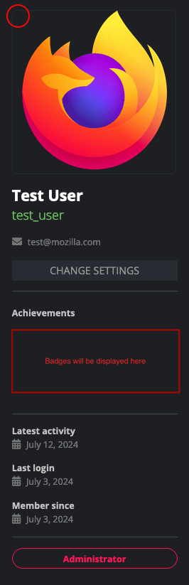

- Feature Name: Gamification Badges 
- Created: 2024-07-11

# Summary

Introduce a badge system in Pontoon to recognize and reward user contributions, promoting engagement and community growth.

# Motivation

Implementing a gamification badge system in Pontoon aims to increase user engagement, motivation, and retention by recognizing and rewarding valuable contributions. By analyzing effective strategies from GitHub, Duolingo, and Stack Overflow, this feature intends to create a supportive and competitive environment that encourages active participation and quality contributions.

# Feature explanation

The badge system consists of various badges awarded based on user activities, such as submitting translations, reviewing translations, and promoting other users. Each badge has multiple levels to cater to both new and experienced users. The badges and their criteria are as follows:

### Review Master Badge
**Description:** Recognizes contributors who actively participate in reviewing translations submitted by others (approving or rejecting a translation), ensuring quality and consistency in the localization process.

**Criteria:**
- **Reviewer Level 1:** Review 5 translations.
- **Reviewer Level 2:** Review 50 translations.
- **Reviewer Level 3:** Review 250 translations.
- **Reviewer Level 4:** Review 1000 translations.

### Translation Champion Badge
**Description:** Rewards contributors for their efforts in submitting translations.

**Criteria:**
- **Translator Level 1:** Submit 5 translations.
- **Translator Level 2:** Submit 50 translations.
- **Translator Level 3:** Submit 250 translations.
- **Translator Level 4:** Submit 1000 translations.

### Community Builder Badge
**Description:** Recognizes Locale Managers who successfully promote other contributors to new roles (contributor → translator and/or translator → team manager), fostering growth and leadership within the community.

**Criteria:**
- **Mentor Level 1:** Successfully promote 1 contributor to a new role.
- **Mentor Level 2:** Successfully promote 2 contributors to a new role.
- **Mentor Level 3:** Successfully promote 5 contributors to a new role.

### Status Icons
**Description:** Visual indicators awarded based on user roles and contributions, providing immediate context to other community members.

**Icons:**
- **New User Icon:** For users who joined less than 3 months ago.
- **Translator Icon:** For users contributing as translators.
- **Manager Icon:** For users serving as locale managers.
- **Admin Icon:** For users holding administrative roles.

# Technical Specification

The badge system will be integrated into the existing Pontoon interface, with badges displayed on user profiles. Status icons will also be visible alongside user avatars in comments and suggestions. The system will track user activities and automatically award badges based on predefined criteria. Detailed implementation steps include:

1. **Backend Development Criteria:**
   - **Activity Tracking:** Track user activities such as translations submitted, translations reviewed, and promotions.
   - **Award Logic:** Implement logic to award badges based on tracked activities.
   - **Data Consideration:** Only new data will be considered for badges (i.e., the data will be tracked and counted towards the badges from the time the feature goes live).
   - **Badge Levels:** Store badge levels and criteria.
   - **Badge Replacement:** When a user reaches a new badge level, it will replace the older version of the badge.
   - **Notifications:** Send notifications to users to communicate their badge achievements (e.g., advancing to a new badge level or obtaining a badge).
   
2. **Frontend Development:**
   - **Badge Display:** Display badges on user profiles under an "Achievements" section (see Mockups). 
   - **Status Icons:** Show status icons universally in the user avatar (see Mockups).
 

# Roles
**Impacts:**
- **Contributors and Translators:** Motivated to submit and review translations.
- **Locale Managers:** Encouraged to mentor and promote contributors.

# Mockups
- **Achievements Section and Status Icon:**

  
    - **Note:** The exact design of the status icons is not finalized yet. The circle on the user avatar represents a placeholder.

# Out of Scope
### Progress Bar
A visual progress bar for badges with different levels to indicate how close a user is to reaching the next level.