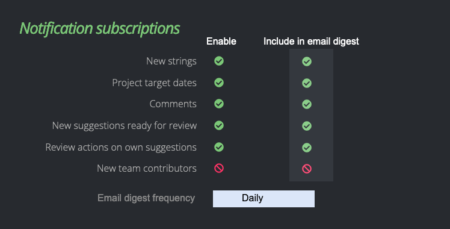
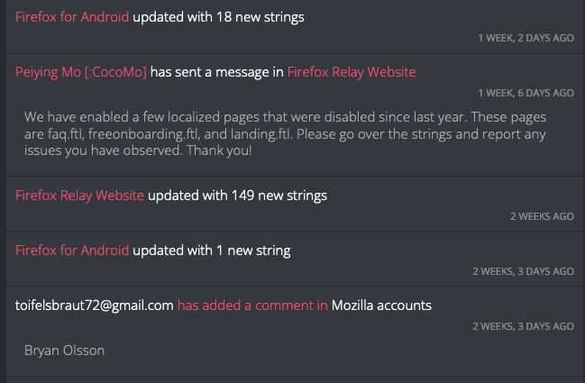

- Feature Name: Transactional Emails
- Created: 2024-08-07
- Associated Issue: #2076

# Summary

Implement the ability to send Pontoon notifications as an email, and to generate a number of automatically triggered transactional email messages to be sent to Pontoon users.

# Motivation

Users receive a number of useful and sometimes time-sensitive notifications within Pontoon. Some users have already indicated that they would like to receive notifications as emails, but we currently do not have the ability to send them. This feature would allow users to indicate which types of notifications they would like to receive as an email.

In addition, this document contains a number of transactional emails to be sent to Pontoon users. The motivation for these are based on an [experiment](https://docs.google.com/document/d/1MY4H4jlxgYDmIsu8CW5q8VN0wo_nSWVCtRSdy119EGA/edit?usp=sharing) and work done in 2023 around transactional emails being sent to inactive users — these emails encouraged re-engagement of some lapsed/dormant users.

Finally, some additional transactional emails are intended to complement upcoming initiatives for improving the onboarding experience for new contributors.

# Feature explanation

## Settings changes

### Sending notifications as email

Users choose what notifications are sent to their email by an “Include in email digest” setting added under the existing “Notification subscriptions” section in settings. No email digest is sent if there are no notifications selected, otherwise an email digest is sent either daily or weekly based on the user’s selection from an “Email digest frequency” dropdown.

This updates the “Notification subscriptions” section to include:

* 2 columns with checkboxes for each notification type.  
* Column 1 label: “Enable”  
  * This maps to the current functionality — enabling this will enable notifications in Pontoon.  
  * Specs / defaults should be preserved from current implementation.  
* Column 2 label (default value: disabled): “Include in email digest”  
  * When enabled, this type of notification will be included in an email sent to the user’s designated email address (either their login account, or the email address they define in the email preferences section.)  
* Dropdown list (default value: Weekly): “Email digest frequency”  
  * Options: “Daily”, “Weekly”  
  * Disable list if nothing enabled in the “Include in email digest” column.

### Monthly activity summary

Users enable or disable a monthly activity report with the “Monthly activity summary” option located in the Email section of settings. This sets an enabled/disabled flag for the user that is referenced to determine if an automated email should be sent to this user.

* Header: “Monthly activity summary”  
  * Located under “Email” section  
  * Contributors are opted-out by default, translators/team managers are opted-in by default in order to reduce the amount of emails being sent.  
* Checkbox (default: see below):  “Receive monthly activity summary email”  
  * Each user model has a flag that corresponds to this checkbox. The flag is referenced by the transactional email trigger to determine if an email is sent. This flag is disabled by default for users except translators and managers.  
  * Flag is enabled for all current users with global translator or manager permissions at time of implementation.  
  * Flag is automatically enabled for a user who receives new global translator or manager permissions. If a user's translator or manager permissions are removed, the user would have to manually disable these emails from their settings.

## New transactional emails

### Activity summary

This sends a summary of a user’s activity, as well as the activity that happened within a particular locale in the last month. The summary provides a snapshot of work and progress happening in the locale, along with trends to prompt action where needed or to show locales they are moving in a positive direction.

Note: This email will be sent with visuals in an HTML format. The design of the template will be determined during the implementation phase.

#### Trigger

Monthly activity summary flag enabled.

#### Template

Subject: Pontoon Monthly Activity Summary  
Body:  
Hello,

Here is your monthly activity summary for the month of [month]:

**Personal activity**

* Translations submitted this month: [translations submitted by user]  
  * Compared to last month: [difference from previous month]  
* Suggestions reviewed this month: [reviews performed by user]  
  * Compared to last month: [difference from previous month]

**Locale activity for [locale name]**

* New source strings: [new source strings for locale]  
* Translation completion trends:  
  * Translations submitted this month: [total peer-reviewed + self-reviewed + reviewed pre-translations for locale]  
    * Compared to last month: [difference from previous month]  
  * Strings with missing translations: [total missing for locale]  
    * Compared to last month: [difference from previous month]  
  * Pretranslated strings without review: [total unreviewed pretranslation strings for locale]  
    * Compared to last month: [difference from previous month]	  
  * Completion: [completion percentage for locale]  
    * Compared to last month: [difference from previous month]  
* Review submission trends:  
  * Submissions reviewed this month: [reviewed translation suggestions]  
    * Compared to last month: [difference from previous month]  
  * Unreviewed suggestions in need of review: [unreviewed translation suggestions]  
    * Compared to last month: [difference from previous month]  
  * Click here to view all unreviewed translations [link to unreviewed translations for locale (all projects)]  
* Contributor activity trends:  
  * New contributors: [list of contributors that joined/added translations in last month]  
  * Recently active contributors:  
    * Managers: [list of active managers]  
    * Translators: [list of active translators]  
    * Contributors: [list of active contributors]

[repeated locale activity if this user is a manager/translator for more than one locale]

Thanks,  
Pontoon Team

*If you would no longer like to receive these activity summaries, you can disable “Monthly activity summary” in your [settings](https://pontoon.mozilla.org/settings/).

#### Frequency

Monthly, sent first day of the following month (e.g. Sent June 1st for the May activity summary)

### Pontoon notification subscriptions digest

Compilation of notifications in a digest (either daily or weekly depending on user preference in settings.)

Note: This email will be sent with visuals in an HTML format. The design of the template will be determined during the implementation phase.

#### Trigger

At least 1 notification type enabled for inclusion in email digest

#### Template

Hello,

Here’s a summary digest of the Pontoon notifications you’ve subscribed to.

**Notifications**  
[list of notifications - following style of /notifications/ in Pontoon (e.g. below screenshot)]

*You can adjust your notifications subscriptions at any time from your [settings](https://pontoon.mozilla.org/settings/).

#### Frequency

Daily: 6 AM UTC  
Weekly: Fridays 6 AM UTC

### Onboarding: Welcome email

#### Trigger

Pontoon account creation

#### Template

Subject: Welcome to Pontoon!  
Body:   
Hello, 

Welcome to Pontoon!

Thank you for becoming part of our localization community! Your translations contribute directly to the Mozilla mission of making the internet open and accessible to all.

Pontoon is our primary tool for enabling contributors from around the world to easily submit translations for all of Mozilla’s products and initiatives. Here are some tips to help get you started.

1. Take a [tour](https://pontoon.mozilla.org/projects/tutorial/playground/) of Pontoon to get familiar with its workflow and features, then play around in the sandbox to try it out for yourself.  
2. Update your [settings](https://pontoon.mozilla.org/settings/) to personalize your Pontoon profile by adding an avatar and username, select between a dark and light theme, and choose your default locale.  
3. Check out your [team](https://pontoon.mozilla.org/teams/) page to find more information and resources about your locale.  
   1. On the contributors tab you can find your locale’s team managers. If you have questions or want to introduce yourself, you can find their contact information in their profile (while logged in).  
   2. The info tab may also contain other links, resources, and information created by your team for new contributors.  
4. Start translating. One of the best ways to get used to translating for Mozilla is to dive right in! Check the [team](https://pontoon.mozilla.org/teams/) page for your locale and find a project to work on: look for a project with progress under 100% and click the “Missing” number that appears when you hover over it - this will show you anything that still needs a translation.

Hopefully you find these tips helpful. We’ll follow up again in a couple of days with some more info about translating on Pontoon.

Finally, as an active member of our community, we’d like you to be aware of the [Mozilla community participation guidelines](https://www.mozilla.org/en-US/about/governance/policies/participation/) to ensure the wellbeing of all members of the community.

If you have any questions in the meantime, you can reach out any time to the Mozilla localization team on [Matrix chat](https://matrix.to/#/#l10n-community:mozilla.org) or [Discourse](https://discourse.mozilla.org/c/l10n/547).  

Thanks,  
Pontoon Team

#### Frequency

Once

### Onboarding: Follow up 2 days later - more tips for getting started

#### Trigger

48 hours after account creation

#### Template

Subject: Translating on Pontoon  
Body:  
Hello,

Thank you again for joining Mozilla’s translation community on Pontoon. As always, you can continue contributing translations to Mozilla products and initiatives at [https://pontoon.mozilla.org/](https://pontoon.mozilla.org/). 

Following up on our welcome email, which had some quick tips to help get you started, we’d like to provide a brief introduction to how localization works at Mozilla. 

**Translation phases**  
Translation goes through roughly four phases:

1. New source strings added: When new strings (individual pieces of text or content that need to be translated) are added, they appear in Pontoon as “Missing” status.  
2. Translation suggestion submitted: When a contributor like you submits a translation suggestion, the status of the translation is set to “Unreviewed”. This alerts translators and team managers (see below) that translations are ready for their review.  
3. Translation review: After a string is reviewed, it will either be approved and appear in Pontoon as “Translated” or receive feedback — possibly in the form of a comment. After outstanding feedback is addressed the strings will be approved.  
4. Translated: Once the new strings are translated, they are ready to be included into the product. The timing depends on the project, but often strings will be implemented at the time of the next build and ready to check in product. Be sure to check the deadlines in the [project](https://pontoon.mozilla.org/projects/) view to understand which strings need translations soon.

Each localization community has its own specific workflows, so do reach out to your [Team Managers](https://pontoon.mozilla.org/*/contributors/) to learn more. 

**Team roles**  
Speaking of team managers, teams can have up to 3 different roles. While all roles contribute translations for their language, some roles have additional responsibilities:

1. Team Manager - Team managers are responsible for managing and growing their language community, including: mentoring new contributors, providing feedback on their translation submissions, and creating language resources. Each locale will have at least one team manager.   
2. Translator - Translators are responsible for reviewing translation submissions and providing feedback to team contributors. Community members that have been evaluated by the team manager and other translators can be assigned the translator role.  
3. Contributor - Contributors submit translation suggestions in Pontoon for their target language. New members of a language community start as a contributor.   

We’ve found that the best way for new contributors to learn and grow within their community is to network with other team members and proactively request feedback from translators and managers on their submissions. If you have trouble reaching other team members or getting feedback, let us or the project manager know (see below).

**Project manager**  
Finally, there is one key point of contact to support you in your translation journey — the project manager. Each project on Pontoon has a project manager assigned to act as the primary point of contact for the project itself. They are there to answer your questions and assist with any problems you are having related to translation of project strings.

If you have a question or issue related to a particular string, you can click the “REQUEST CONTEXT or REPORT ISSUE” button from the translation view in Pontoon. That will create a comment you can fill in with the details and it will notify the project manager. You can also find the project manager’s contact information in their profile by clicking on their name in the field at the top of the project page.

We hope this gives you a better understanding of how localization works at Mozilla. 

If you have any questions, reach out any time to the Mozilla localization team on [Matrix chat](https://matrix.to/#/#l10n-community:mozilla.org) or [Discourse](https://discourse.mozilla.org/c/l10n/547).

Thanks,  
Pontoon Team

#### Frequency

Once

### Onboarding: Week 1 - more localization resources

#### Trigger

1 week after account creation  

#### Template

Subject: More resources for contributors  
Body:  
Hello,

Hello again! This is our final introductory email - so from here on out you won’t find us in your inbox (excluding essential account related communications) unless you choose to sign up for the future email updates described below.

We’d like to provide you with some additional resources that might be useful as you continue in your journey as a member of our localization community.

**Additional documentation:**  
For in-depth documentation on Mozilla localization, see our [Documentation for Mozilla localizers](https://mozilla-l10n.github.io/localizer-documentation/index.html) which includes in depth explanations on topics such as:

* [Community roles](https://mozilla-l10n.github.io/localizer-documentation/community/l10n_community_roles.html)  
* Specific [Mozilla product](https://mozilla-l10n.github.io/localizer-documentation/products/index.html) localization (such as Firefox, Firefox for Android, etc.)  
* Tools such [Pontoon](https://mozilla-l10n.github.io/localizer-documentation/tools/pontoon/index.html) and [Fluent](https://mozilla-l10n.github.io/localizer-documentation/tools/fluent/index.html) (the advanced translation format used by Mozilla)

**Pontoon Add-on:**   
You can use the Pontoon Add-on for [Firefox](https://mozilla-l10n.github.io/localizer-documentation/index.html) or [Chrome](https://chromewebstore.google.com/detail/pontoon-add-on/gnbfbnpjncpghhjmmhklfhcglbopagbb) to be instantly notified of any Pontoon notifications right in your browser, as well as some helpful tools to help with proofreading, bug reporting, and fixing. 

**Mozilla community participation guidelines:**  
As an active member of our community, we’d like you to be aware of the [Mozilla community participation guidelines](https://www.mozilla.org/en-US/about/governance/policies/participation/) to ensure the wellbeing of all members of the community.

**Email settings:**  
Finally, if you’re interested in latest updates, announcements about new Pontoon features, invitations to contributor events and more, be sure to enable email communications in your [settings](https://pontoon.mozilla.org/settings/) so you can be the first to get notified.  
You can also receive Pontoon notifications in a daily or weekly digest — check out the Notification subscriptions section of your settings.

Thanks,  
Pontoon Team

#### Frequency

Once

### Inactive account: Contributor

#### Trigger

All of the following conditions met:

1. Contributor role   
2. At least 1 non-ML translation submitted   
3. No login for 6 months  
4. Has not received inactive account reminder in the past

#### Template

Subject: Mozilla Pontoon account status  
Body:  
Hello! 

It's been a while since we’ve last seen you, but we wanted to thank you for contributing to Mozilla’s community-driven localization efforts at [https://pontoon.mozilla.org/](https://pontoon.mozilla.org/). 

Your contributions have been important in furthering Mozilla’s mission and fostering an open and accessible internet for all readers in your language. We understand that life can get busy, and finding time to contribute to projects isn't always easy. We get it. 

As part of our efforts to keep our localization community active and engaged, we periodically review account activity. We’ve noticed you haven’t signed in to your Pontoon account in the past 6 months. While we completely understand that circumstances change, we wanted to inform you that we may deactivate dormant accounts in the future to ensure the security and efficiency of our platform.

If you’d like to keep your Pontoon account active (we hope you will!) please sign in to Pontoon by visiting [https://pontoon.mozilla.org/](https://pontoon.mozilla.org/) and click the “Sign in” button in the top right corner.

Regardless, we want to express our heartfelt thanks for your commitment to our mission and the positive impact you've made during your time here.

Thanks,  
Pontoon Team

#### Frequency

Once

### Inactive account: Translator

#### Trigger

All of the following conditions met:

1. Translator role (global permission)  
2. User has 0 submissions in last 2 months  
3. User has 0 reviews in last 2 months

#### Template

Subject: Reminder: Contributing to Mozilla Pontoon as a Translator  
Body:  
Dear [Display name],

On behalf of Mozilla, thank you for your commitment and dedication to Mozilla’s mission by taking on the responsibilities of a Translator for your locale. Your contributions have been instrumental in fostering an open and accessible internet for readers in your language. Translators play a critical role in ensuring the health of their community by reviewing and providing timely feedback to contributors’ translation suggestions.

As part of our efforts to keep our localization community active and engaged, we periodically review account activity. We’ve noticed that in the past 2 months you have not submitted any translations or reviewed any translation submissions for your locale. We understand that life can get busy, and finding time to contribute to projects isn't always easy. We get it. 

One of the key [expectations](https://mozilla-l10n.github.io/localizer-documentation/community/l10n_community_roles.html#translator) for Translators is to ensure the timely review of suggestions and to contribute translations for new source language content. In addition to ensuring users in your language receive a fully localized experience, timely review of submissions avoids new and current Pontoon contributors becoming discouraged from making submissions and ensures continued participation in our localization community.

Please take a moment to take action by:

* Reviewing some outstanding translation submissions.  
* Submitting translations for projects with missing translations.  
* Respond to any outstanding feedback from your fellow team members. 

[link to team project page]

You can find more information on role responsibilities and expectations for our localization community roles [here](https://mozilla-l10n.github.io/localizer-documentation/community/l10n_community_roles.html#translator).

Thank you again for your dedication. Together we can continue to make the internet open and accessible to all.

Thanks,  
Pontoon Team

#### Frequency

Once

### Inactive account: Team Manager

#### Trigger

All of the following conditions met:

1. Team Manager role  
2. User has 0 submissions in last 2 months  
3. User has 0 reviews in last 2 months

#### Template

Subject: Reminder: Contributing to Mozilla Pontoon as a Team Manager  
Body:  
Dear [Display name],

On behalf of Mozilla, thank you for your commitment and dedication to Mozilla’s mission by taking on the responsibilities of a Team Manager for your locale. Your contributions have been instrumental in fostering an open and accessible internet for readers in your language. A Team Manager is pivotal to the health of their community, not only by acting as the organizing force and facilitator for internal community discussions, but also in the critical operational work of reviewing and providing timely feedback to contributors’ translation suggestions.

As part of our efforts to keep our localization community active and engaged, we periodically review account activity. We’ve noticed that in the past 2 months you have not submitted any translations or reviewed any translation submissions for your locale. We understand that life can get busy, and finding time to contribute to projects isn't always easy. We get it. 

One of the key [expectations](https://mozilla-l10n.github.io/localizer-documentation/community/l10n_community_roles.html#locale-manager) for Team Managers is to ensure the timely feedback and review of suggestions to contributors and translators. In addition to ensuring users in your language receive a fully localized experience, timely review of submissions avoids new and current Pontoon contributors becoming discouraged from making submissions and ensures continued participation in our localization community.

Please take a moment to take action by:

* Reviewing some outstanding translation submissions.  
* Submitting translations for projects with missing translations.  
* Responding to any outstanding feedback from your fellow team members. 

[link to team project page]

In addition, another Team Manager responsibility is to evaluate candidates for advanced roles within their community. Please review the contributors page for your team and see if there are any motivated and active community members that may be interested in taking on additional responsibilities within your team. [link to the team’s contributors page]

You can find more information on role responsibilities and expectations for our localization community roles [here](https://mozilla-l10n.github.io/localizer-documentation/community/l10n_community_roles.html#locale-manager).

Thank you again for your continued dedication. Together we can continue to make the internet open and accessible to all.

Thanks,  
Pontoon Team

#### Frequency

Once

## Existing Transactional Emails

### Email Verification

Note: highlighted text is a suggested change from current text

Subject: Verify Email Address for Pontoon  
Body:  
Hey [Display name],

Please click on the link below within the next hour to verify your contact email address:  
[url]

You’re receiving this email because you recently changed a contact email address on Pontoon. If this wasn’t you, please ignore this email.

Thanks,  
Pontoon Team

### Request new project(s)

Subject: Project request for [locale] ([locale code])  
Body:  
Please add the following projects to [locale] ([locale code]):  
[list of requested projects]

Requested by [requestor], [requestor role]:  
[link to requestor profile]

### Request pretranslation:

Subject: Pretranslation request for [locale] ([locale code])  
Body:  
Please enable pretranslation for the following projects in [locale] ([locale code]):  
[list of projects]

Requested by [requestor], [requestor role]:  
[link to requestor profile]

[if pretranslation not enabled yet for locale]  
IMPORTANT: Pretranslation is not enabled yet for [locale] ([locale code]). Training a custom engine is required before enabling new projects.
