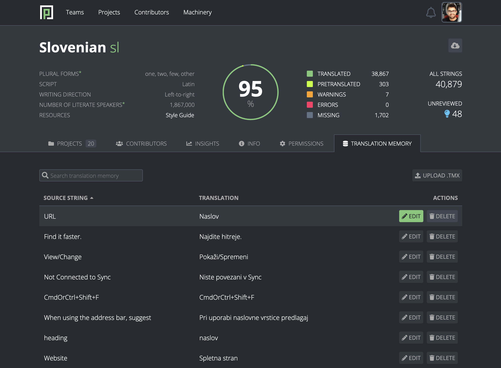

- Feature Name: Translation Memory Management
- Created: 2024-08-28
- Associated Issue: #3031

# Summary

Add ability to edit, delete and upload Translation Memory (TM) entries.

# Motivation

Translation memory is a fundamental tool for faster and more consistent translations, and has become even more important with pretranslation, since it's used to train custom machine translation engines in Google AutoML Translation.

Support for TM in Pontoon is limited:
* Localizers cannot edit or delete existing TM entries directly.
* TM entries can be changed indirectly via translation workspace, but only if the corresponding strings are still available for translation.
* Localizers cannot upload their own translation memories.

# Feature explanation

A new "Translation Memory" tab is added to the Team pages, which lists all TM entries for the team. For each entry, source string and translation are provided, clicking on which leads to the translation workspace for the corresponding strings (using the `?list=` query parameter). Entries are only shown once for each unique combination of source string and translation.

Initially, only the first 100 entries are loaded. Additional entries are loaded in batches of 100 using infinite scroll, a UX pattern that is also used in the string list in translation workspace.

TM entries can be searched by the source string and translation using the Search field. Search is triggered by pressing Enter.

The following actions are available to team managers and translators for their locales and disabled for other users:

1. **Edit**. After clicking the Edit button in the Actions column, the translation of the TM entry transforms into a textarea element and becomes editable. Next to it, Save and Cancel buttons appear. Clicking Save saves any changes to all corresponding TM entries and logs the newly introduced `TM_ENTRY_EDITED` action in the `ActionLog`, referencing the edited TM entry. Clicking Cancel cancels the editing action.

1. **Delete**. After clicking the Delete button in the Actions column, the button changes into the Are you sure? button. Clicking on that button deletes all corresponding TM entries.

1. **Upload**. After clicking the Upload button above the TM entry list, an Open file dialog pops up. The user then selects the TMX file to upload, the TM entries from the file start to import into the team's TM, and eventually a success or error message appears. A newly introduced `TM_ENTRIES_UPLOADED` action is logged in the `ActionLog` in case of success, referencing all newly created TM entries. Based on the performance of the upload function, a maximum file upload size will be imposed.

# Out of scope

* Ability to batch delete uploaded TM entries from the "Translation Memory" tab.
* Ability to update corresponding localizable translations when the TM entry is edited.

# Mockup

*Translation Memory Management*
